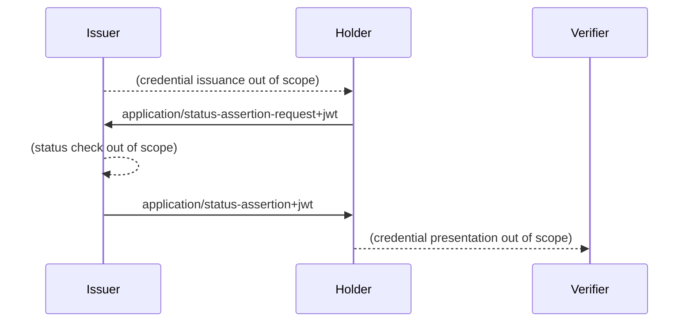

# OAuth Status Assertions

This is the working area for the individual Internet-Draft, "OAuth Status Assertions".

* [Editor's Copy](https://peppelinux.github.io/draft-demarco-oauth-status-assertions/#go.draft-demarco-oauth-status-assertions.html)
* [Datatracker Page](https://datatracker.ietf.org/doc/draft-demarco-oauth-status-assertions)
* [Individual Draft](https://datatracker.ietf.org/doc/html/draft-demarco-oauth-status-assertions)
* [Compare Editor's Copy to Individual Draft](https://peppelinux.github.io/draft-demarco-oauth-status-assertions/#go.draft-demarco-oauth-status-assertions.diff)


# Overview 




## Contributing

See the
[guidelines for contributions](https://github.com/peppelinux/draft-demarco-oauth-status-assertions/blob/main/CONTRIBUTING.md).

Contributions can be made by creating pull requests.
The GitHub interface supports creating pull requests using the Edit (✏) button.


## Command Line Usage

Formatted text and HTML versions of the draft can be built using `make`.

```sh
$ make
```

Command line usage requires that you have the necessary software installed.  See
[the instructions](https://github.com/martinthomson/i-d-template/blob/main/doc/SETUP.md).

