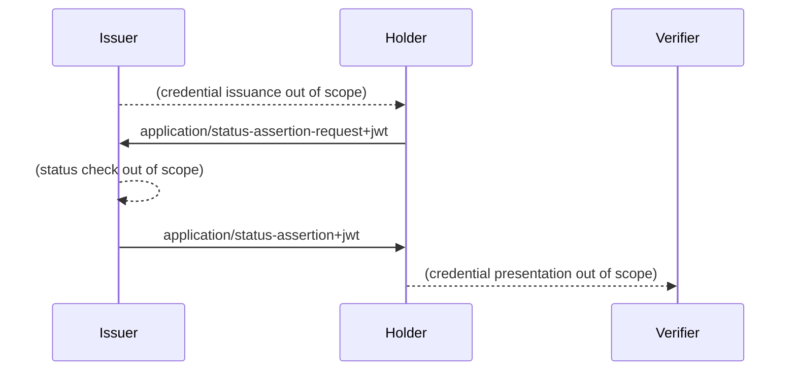

# OAuth Status Assertions

This is the working area for the individual Internet-Draft, "OAuth Status Assertions".

* [Editor's Copy](https://peppelinux.github.io/draft-demarco-oauth-status-assertions/#go.draft-demarco-oauth-status-assertions.html)
* [Datatracker Page](https://datatracker.ietf.org/doc/draft-demarco-oauth-status-assertions)
* [Individual Draft](https://datatracker.ietf.org/doc/html/draft-demarco-oauth-status-assertions)
* [Compare Editor's Copy to Individual Draft](https://peppelinux.github.io/draft-demarco-oauth-status-assertions/#go.draft-demarco-oauth-status-assertions.diff)


# Overview 




# Objectives and Explanation of OAuth Status Assertions

Status Assertions are used to provide evidences about the validity of digital credentials, according to the mechanism where all the information are provided by Wallet and under the sole control of the User. Using the Status Assertions the credential verifiers do not use a direct request to a third party outside of the wallet instance. Status Assertions are periodically issued to the holders of the credentials, who can present them to the verifiers together with the corresponding digital credentials.

## Key aspects of the concept of OAuth Status Assertions:
Status Assertions provide a method to obtain a proof of validity of digital credentials, such as the non revocation of these, without the need for verifiers to access external sources or third parties outside of the Wallet who presents them.

### Purpose and goal: 

The main goal of Status Assertions is to **confirm the status of a digital credential**, such as its non-revocation. This allows Verifiers to check the validity of a Credential without having to access external systems or databases. This increases privacy, reduces latency and facilitates offline verification.

### Functions and process:

1) **Generation:** A Credential Issuer generates a Status Assertion that provides a signed proof of the current status of a Credential.
2) **Request and receipt:** The Holder can request a Status Assertion from the Credential Issuer. This is usually done by means of a request containing a JSON Web Token (JWT) or a CBOR Web Token (CWT) that carries a oproof of possession of the Credential.
3) **Presentation:** The Holder presents the Credential together with its Status Assertion to the Verifier. This process is similar to Online Certificate Status Protocol (OCSP) stapling in the TLS protocol, where the server presents a time-stamped status token.


### Conceptual features:

**Data protection:** The procedure ensures that no unnecessary personal data of the Holder or information about the use of the Credential is passed on to the Verifier or other parties.
**Offline capability:** The ability to check the validity of credentials offline without having to access a central database or online status lists is a key advantage of this approach.
**Independence**: Verifiers do not need direct interaction with the Credential Issuer or other third parties to confirm the status of a Digital Credential, which preservers the privacy and security of the process.

In both secure and privacy-friendly way, Status Assertions provide an effective way to manage the validity and status of Digital Credentials.

## Contributing

See the
[guidelines for contributions](https://github.com/peppelinux/draft-demarco-oauth-status-assertions/blob/main/CONTRIBUTING.md).

Contributions can be made by creating pull requests.
The GitHub interface supports creating pull requests using the Edit (✏) button.


## Command Line Usage

Formatted text and HTML versions of the draft can be built using `make`.

```sh
$ make
```

Command line usage requires that you have the necessary software installed.  See
[the instructions](https://github.com/martinthomson/i-d-template/blob/main/doc/SETUP.md).

