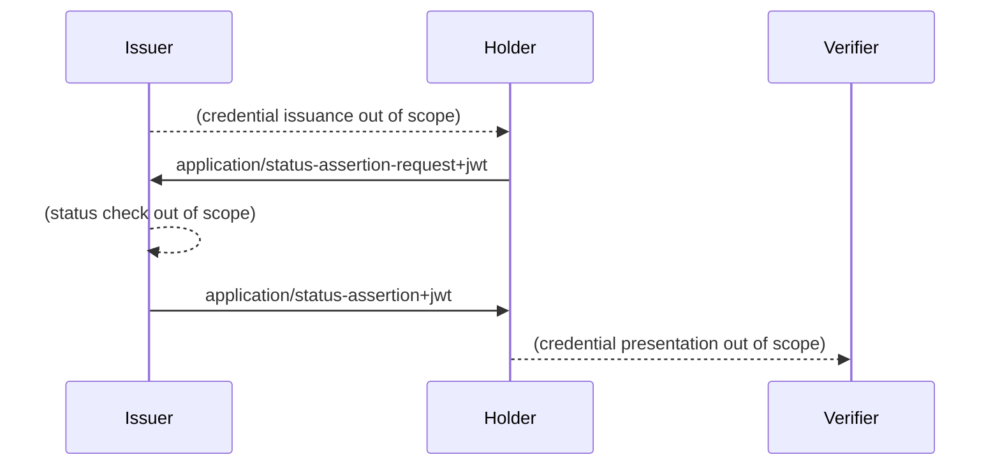

# OAuth Status Assertions

This is the working area for the individual Internet-Draft, "OAuth Status Assertions".

* [Editor's Copy](https://peppelinux.github.io/draft-demarco-oauth-status-assertions/#go.draft-demarco-oauth-status-assertions.html)
* [Datatracker Page](https://datatracker.ietf.org/doc/draft-demarco-oauth-status-assertions)
* [Individual Draft](https://datatracker.ietf.org/doc/html/draft-demarco-oauth-status-assertions)
* [Compare Editor's Copy to Individual Draft](https://peppelinux.github.io/draft-demarco-oauth-status-assertions/#go.draft-demarco-oauth-status-assertions.diff)


# Overview 




# Objectives and Explanation of OAuth Status Assertions

OAuth status assertions are used to check the validity of digital credentials without the need for a direct request to third parties. They are periodically issued to the holders of the credentials, who can present them to the verifiers together with the corresponding digital credentials.

## Key aspects of the concept of OAuth Status Assertions:
OAuth Status Assertions provide a robust method of verifying the validity of digital credentials without the need for verifiers to access external sources or third parties.

### Purpose and goal: 

The main goal of OAuth Status Assertions is to **confirm the non-revocation of a digital credential**. This allows verifiers to check the validity of a credential without having to access external systems or databases. This increases privacy, reduces latency and facilitates offline verification.

### Functions and process:

1) **Generation:** A credential issuer generates a status assertion that provides a signed confirmation of the current status of a credential.
2) **Request and receipt:** The holder of a credential can request a status assertion from the issuer. This is usually done by means of a request containing a JSON Web Token (JWT) or a CBOR Web Token (CWT) that carries specific information about the credential.
3) **Presentation:** The holder presents the credential together with its status assertion to the verifier. This process is similar to Online Certificate Status Protocol (OCSP) stapling in the TLS protocol, where the server presents a time-stamped certificate status token.

OCSP is a protocol used for obtaining the revocation status of an X.509 digital certificate, commonly used in secure network communications to ascertain whether a certificate is still valid or has been revoked. 
On top OCSP is a more efficient alternative to the traditional method of checking against a Certificate Revocation List (CRL) and is widely used because it can provide real-time status information about a certificate’s validity.

### Conceptual features:

**Data protection:** The procedure ensures that no unnecessary personal data of the holder or information about the use of the credential is passed on to the verifier or other parties.
**Offline capability:** The ability to check the validity of credentials offline without having to access a central database or online status lists is a key advantage of this approach.
Independence: Verifiers do not need direct interaction with the issuer to confirm the validity of a credential, which increases the privacy and security of the process.

In this way, OAuth Status Assertions provide an effective way to manage the validity and status of digital credentials in a way that is both secure and privacy-friendly.

## Contributing

See the
[guidelines for contributions](https://github.com/peppelinux/draft-demarco-oauth-status-assertions/blob/main/CONTRIBUTING.md).

Contributions can be made by creating pull requests.
The GitHub interface supports creating pull requests using the Edit (✏) button.


## Command Line Usage

Formatted text and HTML versions of the draft can be built using `make`.

```sh
$ make
```

Command line usage requires that you have the necessary software installed.  See
[the instructions](https://github.com/martinthomson/i-d-template/blob/main/doc/SETUP.md).

